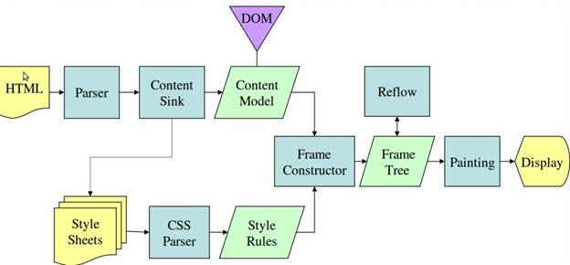

### 1. Introduce

#### Các trình duyệt sẽ được đề cập đến
Hiện nay, có 5 trình duyệt được sử dụng chính trên desktop: Chrome, Firefox, Internet Explorer, Opera và Safari. Trên điện thoại thì có Android Browser, iPhone, Opera Mini và Opera Mobile, UC Browser, trình duyệt của Nokia S40/S60 và Chrome, tất cả ngoại trừ Opera browsers đều dựa trên Webkit. Tôi sẽ đưa ra các ví dụ về các trình duyệt mã nguồn mở, đó là Firefox and Chrome, và Safari.

#### Chức năng chính của trình duyệt
Chức năng chính của trình duyệt là lấy tài nguyên của trang web mà bạn muốn truy cập và hiển thị nội dung trang web đó lên trên cửa sổ của trình duyệt. Tài nguyên của 1 trang web thường là 1 tài liệu HTML, nhưng đôi khi cũng có thể dưới dạng PDF, ảnh ... Vị trí của tài nguyên được xác định bởi người dùng sử dụng 1 URI (Uniform Resource Identifier).

Cách để 1 trình duyệt thông dịch và hiển thị tài liệu HTML tuân theo những quy định về HTML và CSS. Những quy định này được thiết lập bởi tổ chức W3C (World Wide Web Consortium) - là tổ chức lập ra các chuẩn cho web. 

Các giao diện người dùng của các trình duyệt có một số điểm khá giống nhau, đó là:

+ Có thanh nhập địa chỉ URL
+ Có 2 button là Back và Forward trên thanh công cụ
+ Có button tải lại trang 
+ Có button home để trở về giao diện chính của trình duyệt
+ Có thanh bookmark 

Điểm kỳ lạ là giao diện người dùng của các trình duyệt không phải tuân theo bất cứ quy tắc nào, mà nó chỉ được hình thành từ các trải nghiệm của người dùng qua nhiều năm và qua sự bắt chước lẫn nhau. 

#### Cấu trúc cấp cao của các trình duyệt
Dưới đây là các thành phần chính của 1 trình duyệt:

)

**Hình 1:** cấu trúc của 1 trình duyệt

**1. User Interface (UI):** bao gồm thanh địa chỉ, các button back/forware, button home, menu bookmarking, ... tất cả các phần của trình trình duyệt được hiển thị lên, ngoại trừ của sổ mà bạn thấy nội dung của trang web mà bạn yêu cầu.

**2. Brower engine:** Điều khiển hoạt động giữa UI và Rendering engine.

**3. Rendering engine:** chịu trách nhiệm hiển thị nội dung trang web, ví dụ nếu trang web trả về từ server là HTML thì Rendering engine sẽ phân tích cú pháp HTML và CSS để hiển thị nội dung đã được phân tích lên trên màn hình.

**4. Networking:** cung cấp network calls ví dụ như HTTP request, sử dụng các implementations khác nhau cho mỗi nền tảng độc lập khác nhau. (???)

**5. UI Backend:** được dùng để vẽ lên các tiện ích (widgets) cơ bản như 

**6. JavaScript Interpreter:** được dùng để phân tích và thực thi các câu lệnh JavaScript.

**7. Data storage:** đây là lớp persistence (1 loại lưu trữ lâu dài), dùng để lưu trữ các dữ liệu cần thiết tại local như cookie. Các trình duyệt cũng hỗ trợ các cơ chế lưu trữ như localStorage, IndexedDB, WebSQL và FileSystem.

**Chú ý:** các trình duyệt giống như Chrome sẽ chạy 1 ***rendering engine*** cho mỗi tab được mở. Điều này nghĩa là mỗi tab sẽ được chạy trong 1 tiến trình riêng biệt. 

### 2. The Rendering engine
Nhiệm vụ của rendering engine đó chính là render ra kết quả của trang web từ tài liệu HTML để hiển thị lên trên cửa sổ của trình duyệt. Theo mặc định, rendering engine có thể hiển thị được các tài liệu HTML, XML và các hình ảnh. Đối với các kiểu dữ liệu khác, nó có thể dùng các plugin hoặc extension để hiển thị, ví dụ như để hiển thị tài liệu PDF thì rendering engine sử dụng plugin PDF viewer. Tuy nhiên trong tài liệu này, ta sẽ chỉ tập trung và trường hợp sử dụng chính của rendering engine: hiển thị HTML và các hình ảnh được định dạng sử dụng CSS. 

#### Các Rendering engine
Mỗi trình duyệt sẽ sử dụng các rendering engine khác nhau: Internet Explorer sử dụng Trident, Firefox sử dụng Gecko, Safari sử dụng Webkit, Chrome và Opera (từ phiên bản 15) sử dụng Blink - 1 phân loại của Webkit. 

Webkit là 1 rendering engine mã nguồn mở, được bắt đầu xây dựng giống như 1 engine cho Linux platfrom và sau đó được sửa đổi bởi Apple để hỗ trợ cho Mac và Windows. Các bạn vào trang [webkit.org](https://webkit.org/) để biết thêm thông tin.

#### Luồng hoạt động chính

Rendering engine sẽ bắt đầu nhận nội dung của tài liệu được yêu cầu từ tầng networking theo từng đoạn, mỗi đoạn có kích thước là 8kb. Sau đó, rendering engine thực hiện luồng như sau:


**Hình 2:** luồng hoạt động cơ bản của ***rendering engine***

B1: parsing HTML để xây dựng lên cây DOM

B2: xây dựng lên render tree 

B3: bố trí (sắp xếp) render tree

B4: vẽ render tree

Rendering engine sẽ bắt đầu phân tích tài liệu HTML và convert các element thành các node trong cây DOM, hay còn được gọi là ***"content tree"***. Rendering engine sẽ phân tích style của data, cả trong file CSS và trong các thẻ element. Các định dạng về style cùng với cấu trúc cây DOM được sử dụng để tạo ra 1 cây mới, đó là ***render tree***. Render tree chỉ chứa các node cần thiết để tạo nên được trang web.


Các node trong render tree có các thuộc tính hình ảnh như màu sắc và kích thước. Các node này được sắp xếp theo thứ tự được hiển thị lên màn hình.

Sau khi xây dựng được render tree sẽ đến quá trình ***'layout'*** (bố trí). Quá trình này nhắm xác định chính xác tọa độ của 1 node trên màn hình. Bước tiếp theo là vẽ, render tree sẽ được load hết và mỗi node trong đó sẽ được vẽ lên màn hình bằng cách sử dụng tầng UI backend.

Điều quan trọng phải hiểu rằng đây là 1 quá trình từ từ (gradual process). Để người dùng có trải nghiệm tốt hơn, rendering engine sẽ cố gắng hiển thị nội dung lên màn hình sớm nhất có thể. Nó sẽ không đợi cho đến khi tất cả HTML được phân tích trước khi bắt đầu xây dựng và bố trí (sắp xếp) render tree. Từng phần của nội dung trang web sẽ được phân tích và hiển thị lên trong khi vẫn tiếp tục xử lý các phần nội dung còn lại.

#### Ví dụ về luồng hoạt động chính


**Hình 3:** luồng hoạt động chính của **Webkit**



**Hình 4:** Luồng hoạt động chính của **Gecko**

Từ hình 3 và 4, ta thấy rằng mặc dù **Webkit** và **Gecko** sử dụng thuật ngữ hơi khác nhau nhưng luồng hoạt động cơ bản là như nhau.

Gecko gọi cây được tạo lên từ các element là ***'Frame tree'***, trong đó mỗi element là 1 frame. Còn Webkit sử dụng thuật ngữ ***'Render tree'***, bao gồm cả ***'Render objects'*** ở trong đó. Webkit dùng thuật ngữ ***'Layout'*** cho việc đặt chỗ các element, trong khi Gecko sử dụng ***'Reflow'***. ***'Attachment'*** là thuật ngữ mà Webkit dùng để thể hiện sự kết nối các node trong DOM và các node trong cây CSS để tạo nên render tree. Nhưng Gecko có 1 sự khác biệt nhỏ trong phần này, đó là Gecko có 1 lớp ***'Content Sink'*** giữa HTML và cây DOM, và đây là lớp để tạo nên các element trong cây DOM. Bây giờ ta sẽ cùng đi vào tìm hiểu từng thành phần một.

### 3. Quá trình phân tích và tạo nên cây DOM

#### 3.1 Phân tích - tổng hợp

Do parsing (phân tích) là 1 tiến trình rất quan trọng trong rendering engine nên ta sẽ tìm hiểu sâu về phần này.

Phân tích 1 tài liệu nghĩa là dịch tài liệu đó thành 1 cấu trúc mà các đoạn code có thể hiểu được. Kết quả của quá trình phân tích luôn luôn là 1 cây các node, thể hiện cấu trúc của tài liệu. Đó được gọi là 'parse tree' hay 'syntax tree'.

Ví dụ, phân tích biểu thức: 2 + 3 -1 sẽ được kết quả là cây như sau:


**Hình 5:** cây các node của biểu thức toán học 2 + 3 - 1

**Grammars**

Parsing được dựa trên các luật về cú pháp của tài liệu: ngôn ngữ hoặc định dạng tạo nên tài liệu. Tất cả các định dạng bạn có thể phân tích phải có các quy định ngữ pháp bao gồm các luật về từ vựng và về cú pháp. Nó được gọi là ***'(context free grammar)'***. Ngôn ngữ của con người không thể phân tích được với các kĩ thuật phân tích thông thường.

**Sự kết hợp Parser-Lexer**

Quá trình phân tích có thể được chia làm 2 giai đoạn: phân tích từ vựng và phân tích cú pháp. 

Phân tích từ vựng (lexer) là quá trình chia các input vào trong các token. Các token là những từ vựng của ngôn ngữ: tập hợp của các block được xây dựng lên 1 cách hợp lệ. Trong ngôn ngữ của con người thì nó có thể được hiểu là tất cả các từ xuất hiện trong từ điển của ngôn ngữ đó. Quá trình phân tích từ vựng sẽ tự loại bỏ các kí tự không liên quan như các khoảng trắng hoặc kí tự xuống dòng.

Phân tích cú pháp (parser) là áp dụng các quy tắc cú pháp ngôn ngữ để phân tích và xây dựng lên cây cú pháp (parse tree).


**Hình 6:** quá trình từ tài nguyên của tài liệu để xây dựng lên cây phân tích (parse tree)

Quá trình phân tích được lặp đi lặp lại. Trong đó, quá trình phân tích cú pháp (parser) sẽ luôn luôn "hỏi" quá trình phân tích từ vựng (lexer) xem có token nào mới không và cố gắng để khớp token với 1 trong các quy tắc cú pháp. Nếu 1 quy tắc phù hợp với token, 1 nút tương ứng với token đó sẽ được thêm vào trong cây phân tích và quá trình phân tích cú pháp lại đi yêu cầu và kiểm tra token khác.

Nếu không có quy tắc phù hợp đối với 1 token, thì parser sẽ lưu token đó nội bộ, và tiếp tục yêu cầu cho token cho tới khi tìm được 1 luật phù hợp với tất cả các token được lưu trữ nội bộ. Nếu không có quy tắc nào được tìm thấy thì parse sẽ đưa ra 1 ngoại lệ (exception). Điều này có nghĩa là tài liệu không hợp lệ, có chứa lỗi về cú pháp.

**Translation**

Trong nhiều trường hợp, các cây phân tích không phải là sản phẩm cuối cùng. Quá trình phân tích thường được sử dụng trong quá trình chuyển đổi: chuyển đổi các tài liệu đầu vào sang 1 định dạng khác. 1 ví dụ đó là trình biên dịch. Trình biên dịch được dùng để biên dịch mã nguồn thành mã máy, đầu tiên là phân tích tài liệu thành cây phân tích, sau đó chuyển đổi cây phân tích đó sang mã máy và đưa vào trong 1 tài liệu mã máy. 


**Hình 7:** quá trình biên dịch

**Ví dụ về quá trình phân tích**

Trong hình 5, chúng ta đã xây dựng 1 cây phân tích từ 1 biểu thức toán học. Bây giờ ta sẽ cùng nhau định nghĩa 1 ngôn ngữ toán học đơn giản và xem quy trình phân tích.

Từ vựng: ngôn ngữ của chúng ta có thể bao gồm các số nguyên, dấu cộng và dấu trừ.

Cú pháp:

1. Các khối (block) cú pháp ngôn ngữ là các biểu thức, các số hạng và các phép toán.
2. Ngôn ngữ của chúng ta có thể bao gồm bất kì số nào trong các biểu thức toán học.
3. 1 biểu thức được định nghĩa là 1 số hạng sau đó đến 1 phép toán rồi lại đến 1 số hạng khác.
4. 1 phép toán là 1 dấu cộng hoặc 1 dấu trừ
5. Một số hạng là 1 số nguyên hoặc 1 biểu thức. 

Bây giờ ta cùng phân tích đầu vào: 2 + 3 - 1

Chuối con đầu tiên - số 2 - phù hợp với quy tắc số 5. Chuối con thứ 2 phù hợp đó là 2 + 3 - phù hợp với quy tắc số 3. Và tiếp theo sẽ là cả chuỗi đầu vào, vì ta có thể coi 2 + 3 là 1 số hạng theo quy tắc 5, sau đó áp dụng tiếp quy tắc 3 nên cả chuối đầu vào sẽ là 1 biểu thức. 

**Định nghĩa chính thức cho từ vựng (vocabulary) và cú pháp**

Từ vựng thường được biểu diễn bởi các biểu thức chính quy (regular expression).

Ví dụ ngôn ngữ của chúng ta sẽ được định nghĩa là:

```sh
	INTEGER: 0|[1-9][0-9]*
	PLUS: +
	MINUS: -
```
Như bạn thấy, các số nguyên của chúng ta được xác định bởi biểu thức chính quy. 

Cú pháp thường được định dạng trong 1 tài liệu gọi là BNF.  Ngôn ngữ của chúng ta sẽ được định nghĩa cú pháp như sau:
```sh
	expression :=  term  operation  term
	operation :=  PLUS | MINUS
	term := INTEGER | expression
```
Chúng tôi cho rằng 1 ngôn ngữ có thể được phân tích bằng cách phân tích cú pháp chính quy nếu ngữ pháp của nó là 1 "context free grammar". Để tìm hiểu thêm về BNF và context-free grammar, bạn có thể tìm hiểu ở [đây](https://en.wikipedia.org/wiki/Context-free_grammar).

**Các loại phân tích**

Có 2 kiểu phân tích, đó là phân tích từ trên xuống (top down) và phân tích từ dưới lên (bottom up).

....

**Tạo bộ phân tích tự động**

Có các tool giúp ta tạo ra 1 bộ phân tích. Ta đưa vào ngữ pháp của ngôn ngữ mà ta dùng - bao gồm từ vựng và cú pháp của ngôn ngữ đó - và các tool đó sẽ tự tạo ra 1 bộ phân tích. Tạo ra 1 bộ phân tích đòi hỏi phải có 1 sự hiểu biết sâu sắc về phân tích và không dễ dàng để ta có thể tạo ra 1 bộ phân tích tối ưu bằng tay, do đó, ta nên sử dụng các tool giúp tạo ra 1 bộ phân tích tối ưu dễ dàng hơn.

Webkit sử dụng 2 tool phổ biến là: ***Flex*** để tạo ra 1 bộ phân tích từ vựng (lexer) và ***Bison*** để tạo ra 1 bộ phân tích cú pháp. Đầu vào của Flex là 1 tập tin có chữa các định nghĩa về các biểu thức quy định (regular expression) cho các token. Còn đầu vào của Bison là các quy tắc cú pháp của ngôn ngữ dưới định dạng BNF. 

#### 3.2 Phân tích cú pháp HTML

Công việc phân tích cú pháp HTMl là phân tích các đoạn mã HTML để tạo nên 1 cây phân tích (parse tree).

**Định nghĩa về ngữ pháp của HTML**

Các từ vựng và cú pháp của HTML được định nghĩa trong các quy định ([specifications](https://www.html5rocks.com/en/tutorials/internals/howbrowserswork/#w3c)) của tổ chức W3C.

**Không phải là 1 context free grammar**

Như ta đã thấy trong phần giới thiệu về phân tích, cú pháp ngữ pháp sử dụng 1 định dạng chính thức là BNF.

Nhưng thật không may là tất cả các chủ đề phân tích cú pháp thông thường không áp dụng được cho HTML (nhưng sẽ được sử dụng trong phân tích CSS và JavaScript nên ta sẽ tìm hiểu sau). HTML không thể dễ dàng được xác định bởi 1 context free grammar.

Có 1 định dạng chính thức để định nghĩa tài liệu HTML, đó chính là DTD (Document Type Definition) - nhưng DTD cũng không phải là 1 context free grammar. 

Nhưng như ta đã biết, HTML khá gần với XML, và XML thì có rất nhiều các trình phân tích cú pháp có sẵn. Nhưng chúng đều không dùng được đối với HTML.

Điều tạo nên sự khác biệt trên đó chính là tính chất 'bỏ qua' của HTML: cho phép ta bỏ qua 1 số thẻ (các thẻ bị bỏ qua này sẽ được thêm ngầm sau đó) hoặc bỏ qua đầu thẻ hoặc đóng thẻ trong quá trình viết code. Đây chính là tính mềm mỏng trong cú pháp của HTML, khác với sự cứng nhắc của XML. 

**HTML DTD**

HTML được xác định trong định dạng DTD. Địng dạng DTD chứa các định nghĩa cho tất cả các phần tử (element), như các thuộc tính và cấp bậc của chúng trong cây.

**DOM** 

**Thuật toán phân tích**

Như ta đã thấy trong các phần trước thì HTML không thể sử dụng cách phân tích từ trên xuống hoặc phân tích từ dưới lên.

Lý do là do:

+ Tính chất 'bỏ qua' của HTML
+ Thực tế là các trình duyệt đều có khả năng chịu lỗi riêng để hỗ trợ các trường hợp không hợp lệ nổi tiếng của HTML.
+ Quá trình phân tích cú pháp là 'reentrant'. Đối với mỗi ngôn ngữ thì source code là không thay đổi trong suốt quá trình phân tích, nhưng với HTML là ngôn ngữ mã động (dynamic code) (chẳng hạn như các phần tử script có gọi đến hàm document.write() ) nên có thể thêm các token phụ, do đó quá trình phân tích thực sự làm thay đổi đầu vào.

Do không thể sử dụng các kỹ thuật phân tích cú pháp thông thường nên các trình duyệt đã tạo ra phân tích cú pháp tùy chỉnh để phân tích HTML.

Thuật toán phân tích được mô tả chi tiết trong đặc tả của HTML5. Thuật toán gồm có 2 giai đoạn: tokenization và xây dựng cây.

Tokenization là phân tích từ vựng, phân tích input vào trong các token. Các token HTML là thẻ bắt đầu, thẻ kết thúc, tên các thuộc tính và giá trị các thuộc tính. 

Quá trình tokenizer sẽ nhận các token và đưa nó cho quá trình xây dựng cây, sau đó tokenizer lại tiếp tục tiêu thụ các kí tự tiếp theo để nhận biết được token tiếp theo, và cứ thế cho đến khi hết input.


**Hình 8:** quá trình phân tích HTML

**Thuật toán tokenization**

**Thuật toán xây dựng cây**

**Các hành động khi kết thúc quá trình phân tích**

**Khả năng chịu lỗi của trình duyệt**

Bạn sẽ không bao giờ nhận được một lỗi "Cú pháp không hợp lệ" trên 1 trang HTMl. Trình duyệt sẽ sửa bất cứ lỗi không hợp lệ nào và đi tiếp.

Ví dụ như:
```sh

	<html>
	    <mytag>
	    </mytag>
	    <div>
	    <p>
	    </div>
	        Really lousy HTML
	    </p>
	</html>
```

